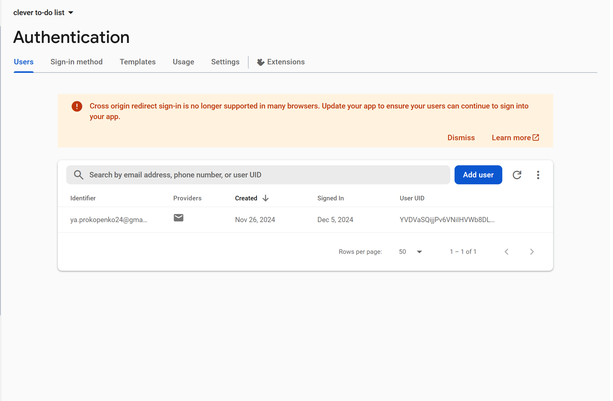
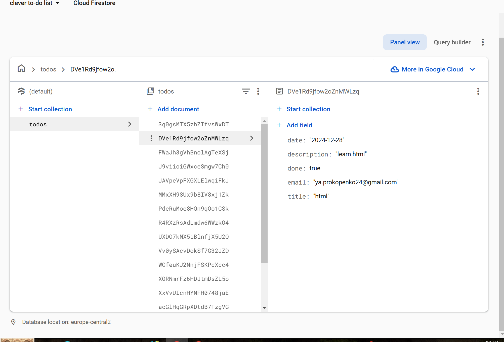

# **Simple calculator**

1. ### **Task** (https://drive.google.com/file/d/18I1PxOxZn2lwm__YeOtMNoWeiXygKwwN/view).

This project implements functions such as addition, subtraction, multiplication, division, sign change and percentage.
Theme management has also been implemented.

2. ### **How to run the app.**

* In the project directory, you can run:

##### **npm dev**

Runs the app in the development mode.
Open  http://localhost:5173/clever-to-do-list/ to view it in the browser.

* To set up a production build, run the command:

##### **npm run build**

Link to application deployment (https://github.com/soneyk0/clever-to-do-list)

3.  ### **Database snapshot.**

4. ### **Application stack and description of the application structure.**

The project used technologies such as Vue, Vite, Vue Router, Vue3-Toastify, firebase.

clever to-do list
- src
    - appRoutes 
        - router.js (Contains the routing logic, mapping paths to Vue components.)
    - assets (Folder for static assets (images)).
    - components (Folder containing Vue components that are used in the app.)
        - AuthorizationForm.vue (A form component for user authentication (login).)
        - Calendar.vue (A component for displaying a calendar view.)
        - HomePage.vue (The main page of the to-do list app.)
        - RegistrationForm.vue (A form component for user registration.)
        - UpdateTask.vue (A form component for updating an existing task.)
    - App.vue (The root Vue component that ties everything together.)
    - main.js (The entry point of the app, where Vue instance and plugins are initialized.)
    - styles.css (Global CSS styles for the app.)
    - index.html (The main HTML file, typically the starting point for the app)
  

